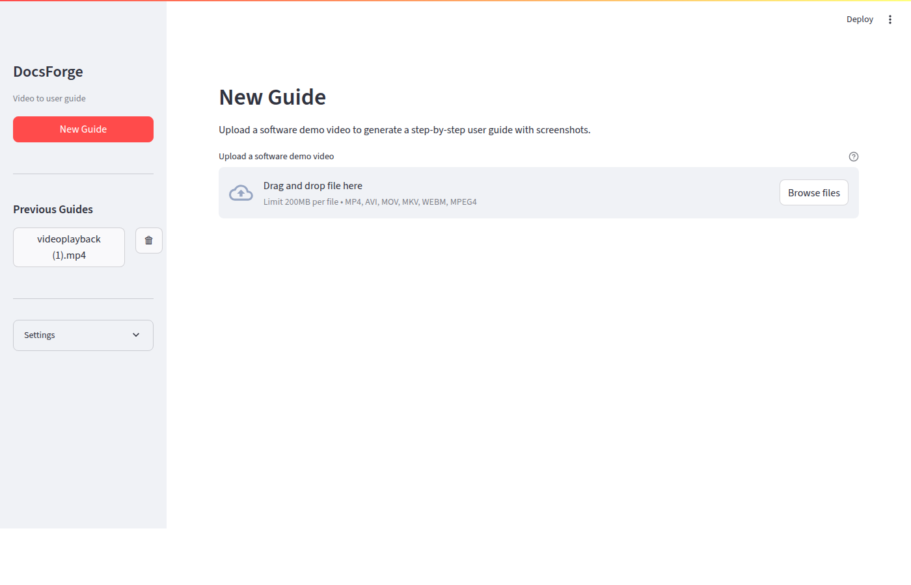

# DocsForge — Video-to-User-Guide Agent


[](https://frankmark94-docsforge---user-guide-agent-app-vvqkld.streamlit.app/)

---

DocsForge takes software demo videos and automatically generates structured user guides with inline screenshots. Upload a screen recording, get a polished step-by-step guide ready for your docs.

Built with LangGraph for orchestration, Claude for multimodal analysis, OpenAI Whisper for transcription, ChromaDB for vector storage, and Streamlit for the UI. All pipeline steps are traced to LangSmith.

## Screenshot


*Upload a demo video, view previous guides in the sidebar, and configure settings.*

## How It Works

```
Upload Video → Extract Audio → Extract Frames → Transcribe → Embed → Select Screenshots → Generate Guide
```

| Step | What Happens |
|------|-------------|
| **1. Extract Audio** | ffmpeg pulls the audio track as 16kHz mono WAV |
| **2. Extract Frames** | OpenCV captures frames at intervals + scene change detection |
| **3. Transcribe** | OpenAI Whisper API generates timestamped transcript segments |
| **4. Embed** | Transcript chunks and frame metadata stored in ChromaDB |
| **5. Select Screenshots** | Claude vision evaluates frames, rates importance, picks the best |
| **6. Generate Guide** | Claude writes a structured Markdown guide with inline screenshots |

## Quick Start

### Prerequisites

- Python 3.10+
- ffmpeg installed (`sudo apt install ffmpeg` or `brew install ffmpeg`)
- API keys for Anthropic, OpenAI, and LangSmith

### Install

```bash
git clone https://github.com/frankmark94/DocsForge---User-Guide-Agent.git
cd DocsForge---User-Guide-Agent
pip install -r requirements.txt
```

### Configure

```bash
cp .env.example .env
# Edit .env with your API keys
```

### Run

```bash
streamlit run app.py --server.headless true
```

Open http://localhost:8501 in your browser.

## Usage

1. Upload an MP4/AVI/MOV/MKV/WebM software demo video
2. Adjust settings in the sidebar (frame interval, max screenshots)
3. Click **Generate Guide**
4. View the result across four tabs:
   - **User Guide** — rendered Markdown with inline screenshots
   - **Transcript** — timestamped speech-to-text
   - **Screenshots** — all selected keyframes with captions
   - **Artifacts** — export as Markdown (ZIP), HTML, or PDF + generation metadata

Previous guides are saved automatically and accessible from the sidebar.

## Project Structure

```
DocsForge/
├── app.py                        # Streamlit UI
├── config.py                     # Settings and env var loading
├── history.py                    # Session persistence (JSON-based)
├── requirements.txt              # Python dependencies
├── .env.example                  # Template for API keys
├── pipeline/
│   ├── state.py                  # PipelineState TypedDict
│   ├── graph.py                  # LangGraph StateGraph (6 nodes)
│   ├── utils.py                  # Base64, HTML/PDF/ZIP export helpers
│   ├── embeddings.py             # ChromaDB vector store management
│   └── nodes/
│       ├── extract_audio.py      # ffmpeg audio extraction
│       ├── extract_frames.py     # OpenCV frame + scene detection
│       ├── transcribe.py         # OpenAI Whisper transcription
│       ├── embed_video.py        # Vector embedding into ChromaDB
│       ├── select_keyframes.py   # Claude vision keyframe selection
│       └── generate_guide.py     # Claude guide generation
├── output/                       # Runtime artifacts (gitignored)
├── chroma_store/                 # ChromaDB persistent storage (gitignored)
└── history/                      # Saved guide sessions (gitignored)
```

## Observability

All pipeline runs are traced to LangSmith. Set `LANGSMITH_PROJECT` in your `.env` to control which project traces appear under. View traces at [smith.langchain.com](https://smith.langchain.com).

## Tech Stack

| Component | Technology |
|-----------|-----------|
| Orchestration | LangGraph StateGraph |
| Guide & Screenshot Analysis | Claude (Anthropic) |
| Transcription | OpenAI Whisper API |
| Embeddings | OpenAI text-embedding-3-small |
| Vector Store | ChromaDB |
| Observability | LangSmith |
| UI | Streamlit |
| Video Processing | OpenCV, ffmpeg |
| PDF Export | WeasyPrint |

## License

MIT
